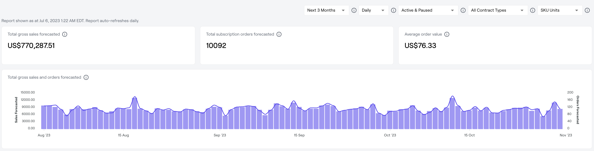

---
layout:
  title:
    visible: true
  description:
    visible: false
  tableOfContents:
    visible: true
  outline:
    visible: true
  pagination:
    visible: true
---

# Forecasting

Recurly CommerceForecasting unlocks smarter revenue and subscription order predictions.  With Recurly CommerceForecasting, merchants can accurately predict future revenue, orders, and SKU sales for the next 12 months.&#x20;

### Overview

Forecasting leverages current active, paused, and dunning subscriptions to forecast out future orders and revenue.&#x20;

<figure><figcaption>
Interactive dashboard of key forecasting metrics
</figcaption></figure>

<figure><figcaption>
Daily breakdown of forecasted gross sales &#x26; orders 
</figcaption></figure>

<figure><figcaption>
Daily breakdown of forecasted SKU units per product variant 
</figcaption></figure>

* The dashboard can be filtered to show forecasts for:&#x20;
  * &#x20;The current month
  * Next 3 months
  * Next 6 months
  * Next 12 months
* Data can be aggregated on a daily or monthly basis &#x20;
* Forecasts can be based of off:&#x20;
  * Active contracts only&#x20;
  * Active & paused contracts&#x20;
  * Active & paused & dunning contracts&#x20;
* Data can be shown as:&#x20;
  * SKU Units or&#x20;
  * Revenue&#x20;


Forecasts are auto-refreshed on a daily basis. The time of refresh will be noted in the dashboard and is not updated in real time.&#x20;


### Metrics

The following metrics are available in Forecasting:&#x20;

Total gross sales forecasted 

Forecasted total gross sales from subscription orders for the selected period.

Total subscription orders forecasted

Forecasted total number of subscription orders for the selected period.

Forecasted average order value (AOV) 

Forecasted average total of every subscription order for the selected period.


Forecasting is only available on Pro or Enterprise plans. Want to upgrade? Contact us at support@recurly.com&#x20;

