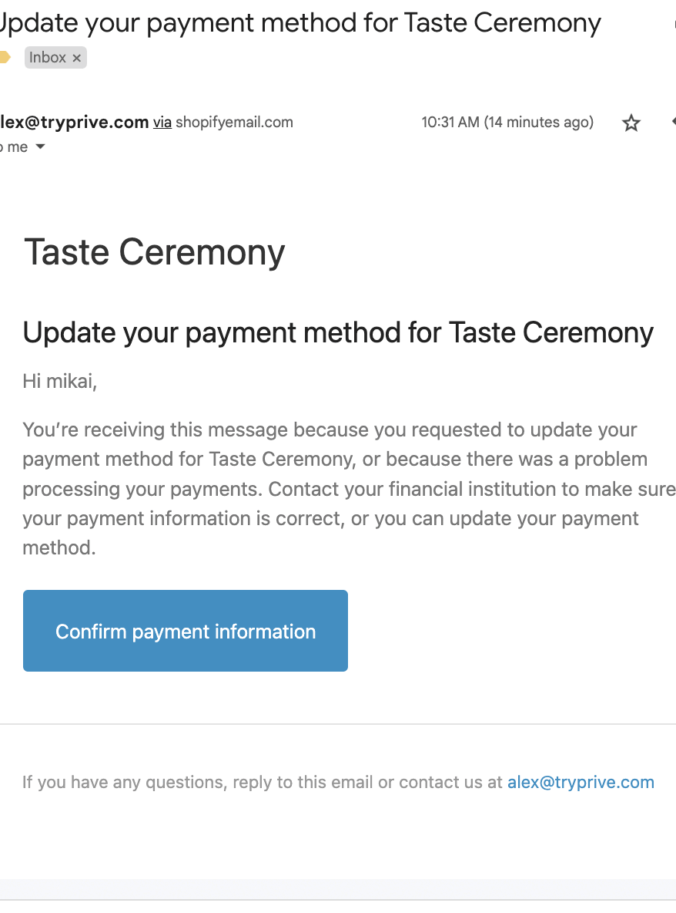

# ⚡ Editing subscriptions for your subscribers

<figure><figcaption></figcaption></figure>

## Subscriber Status

Once the intended subscriber is found, click anywhere on their line item and a secondary page will appear with their name, email, phone number, and 1 of 3 statuses:

1. **Active:** This means the contract is active with no issues found.
2. **Inactive:** This means the contract is cancelled.
   * (Click the “Reactivate” button to reactivate a subscription contract)
3. **Failed (in dunning):** This means the contract’s payment method is currently being re-tried through a process called dunning.
   * (Pause and unpause the contract to stop dunning and bring the contract back to an active state)

<figure><figcaption></figcaption></figure>

## Merchant Functions to Manage a Contract

### Edit Phone Number

To change the phone number for a customer select the edit square above “Phone” at the top of a customer’s contract to enter in a new phone number.

<figure><figcaption></figcaption></figure>

### Edit Email

To change a customer email address please reach out to [**support@recurly.com**](mailto:support@recurly.com)

Subscribers nor merchants can make changes at this time to email addresses because the subscription contract is tied to the email address and is used to leverage the one-time password portal. Recurly Commerce customer support can assist with this functionality should it be needed.

### Set Delivery/Renewal

Select a new date the subscriber’s payment method will be charged. This will change the date the subscriber is charged on all subsequent renewals/deliveries.

<figure><figcaption></figcaption></figure>

<figure><figcaption></figcaption></figure>

### Process Now

Selecting this button will immediately charge the payment method on file in a subscriber’s subscription contract.

<figure><figcaption></figcaption></figure>

### Edit Frequency

Select a new frequency for the subscriber from the pre-configured options. This change will take effect on all subsequent renewals/deliveries.

<figure><figcaption></figcaption></figure>

<figure><figcaption></figcaption></figure>

### Change Price

Input a new price for the subscription products in the contract. This will change the pricing for all subsequent renewals/deliveries however, it will not change the price of product for other subscribers/customers.

<figure><figcaption></figcaption></figure>

<figure><figcaption></figcaption></figure>

### Pause

Pausing the contract will be indefinite or based on a specific number of deliveries (dependent on pre-configuration by the merchant).

<figure><figcaption></figcaption></figure>

### Skip Next

Select one or more order(s) to be skipped. The renewals will resume after this order is skipped.

<figure><figcaption></figcaption></figure>

### Update Quantity

Select a new quantity amount for the products in the subscription contract. This will affect all future renewals/deliveries.

<figure><figcaption></figcaption></figure>

<figure><figcaption></figcaption></figure>

### Coupon/Discount Codes

Add a coupon code created in the “Discounts” section of the Shopify storefront and add it directly to a customer’s contract.

<figure><figcaption></figcaption></figure>

<figure><figcaption></figcaption></figure>

### Swap Product

Change the product that is currently selected by swapping to another product SKU that has been previously configured in the “Product Swap and Add-ons” section of the “Subscription Plans” tab.

<figure><figcaption></figcaption></figure>

<figure><figcaption></figcaption></figure>

### Add-on Subscription Product

A subscription product will be added on to all subsequent renewals/deliveries.

<figure><figcaption></figcaption></figure>

<figure><figcaption></figcaption></figure>

### One time Add-on Product

A subscription product will be added once to a specific renewal/delivery of choice.

<figure><figcaption></figcaption></figure>

<figure><figcaption></figcaption></figure>

### Cancel Subscription

Cancelling the subscription will immediately stop all subsequent renewals/deliveries in the contract and push the contract status to an “inactive” state.

<figure><figcaption></figcaption></figure>

Once this button has been selected, a pop-up will appear asking you to confirm the cancellation.

<figure><figcaption></figcaption></figure>

### Reactivate a Subscription Contract

Subscription contracts that have been cancelled can be reactivated anytime by the merchant or the subscriber. Navigate to the “Customers” tab and select the “Inactive” tab at the top of the page.

<figure><figcaption></figcaption></figure>

Once the intended subscriber has been found, click the “reactivate” button in the contract.

<figure><figcaption></figcaption></figure>

A pop-up will appear asking you to confirm the reactivation.

<figure><figcaption></figcaption></figure>

The subscription contract will immediately revert to an active status and be a line item that appears in the “Active” tab with other active subscription contracts.

### Update Shipping Information

To update the shipping information select the “edit” button in the Shipping Information section of the subscription contract.

<figure><figcaption></figcaption></figure>

Change the name, address, city, state, zipcode, and country as necessary. Be sure to click the purple “update” button to have the changes reflected.

<figure><figcaption></figcaption></figure>

### Update Billing Information

To update the billing information, select the “send an email to reset” button. This will send an email to the subscriber to reset their billing information through the Shopify payments gateway.

_**Note:** Merchants cannot update the billing information of a subscriber outside of sending the reset email because merchants do not have access to the subscriber’s payment details nor access to their email accounts._

<figure><figcaption></figcaption></figure>

Once the button has been clicked a notification will appear confirming the email has been sent to the subscriber.

<figure><figcaption></figcaption></figure>

When the subscriber has completed the update with Shopify payments, the Recurly Commerce system will update the subscription contract.

<figure><figcaption></figcaption></figure>

## Create a Subscription Contract&#x20;

To create a subscription contract visit the “Subscriptions” tab and select the button “create contract” in the top right hand corner. This feature will only work if the customer in question has an existing subscription contract. Shopify will only allow a new contract to be created if the subscriber payment and contract information already exists.

_**Note:**_ Subscriptions under the same email cannot be separated. If a subscriber wishes to have more than 1 contract separated from the same email, they must checkout with a new subscription under a different email. All subscriptions bought with the same email address are merged together in the customer and merchant portals.

<figure><figcaption></figcaption></figure>

<figure><figcaption></figcaption></figure>


Still need help or have questions about managing subscribers?  Contact support@recurly.com


###
